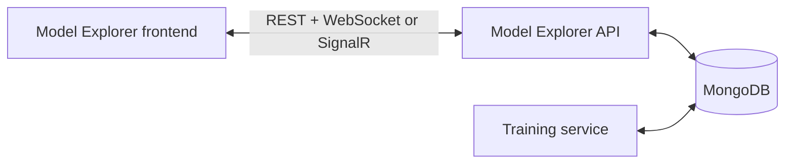

# Model Explorer Frontend

React and TypeScript browser interface for comparing model-training runs and managing training jobs. It combines REST snapshots with live updates from either the [FastAPI/WebSocket backend](https://github.com/justinlee76/model-explorer-api-fastapi) or the [ASP.NET Core/SignalR backend](https://github.com/justinlee76/model-explorer-api-aspnet).

## Features

### Model exploration

- Browse runs by tag and sort the model table by any displayed column.
- Compare any combination of models and metrics on an epoch-history chart.
- Zoom with the mouse wheel or pinch gesture and pan along the epoch axis.
- Receive new models, status changes, and metric points while training is in progress.
- Delete selected trained models while protecting active runs.

### Training jobs

- Submit jobs using the tasks stored in the shared database and exposed by the API.
- Edit positional `args` as a JSON array and keyword `kwargs` as a JSON object, with validation before submission.
- Follow job status and logs in real time.
- Stop running jobs and delete submitted, completed, failed, or stopped jobs.

## How it fits together



The API supplies model and job data to this frontend. The optional [training service](https://github.com/justinlee76/model-explorer-training-service) consumes submitted jobs and writes their logs, metrics, and results to the same MongoDB database. You can browse existing data without the worker, but submitted jobs remain `Submitted` until a worker processes them.

## Requirements

- Node.js 20 (20.19+), Node.js 22 (22.13+), or Node.js 24+
- npm
- One compatible Model Explorer API:
  - [FastAPI](https://github.com/justinlee76/model-explorer-api-fastapi#quick-start) for native WebSockets
  - [ASP.NET Core](https://github.com/justinlee76/model-explorer-api-aspnet#quick-start) for SignalR

Executing jobs also requires the [training service](https://github.com/justinlee76/model-explorer-training-service#quick-start) and at least one registered training task. The backend documentation covers its MongoDB and CORS requirements.

## Quick start

Start the selected API first. Then run:

```bash
git clone https://github.com/justinlee76/model-explorer-frontend.git
cd model-explorer-frontend
npm ci
```

Copy the environment template for the API you started:

```bash
# FastAPI
cp .env.fastapi.example .env

# Or ASP.NET Core
cp .env.aspnet.example .env
```

Then start the frontend:

```bash
npm run dev
```

Open the address printed by Vite, normally <http://localhost:5173>. The FastAPI template connects to `http://localhost:8000/api/`; the ASP.NET Core template connects to `http://localhost:5071/api/`.

If Vite selects another port, add that exact origin to the backend's CORS allowlist and restart the backend.

## Backend configuration

Choose the environment values that match the running API.

### FastAPI and WebSockets (`.env.fastapi.example`)

```dotenv
VITE_API_URL=http://localhost:8000/api/
VITE_MESSAGING_TRANSPORT=websocket
```

### ASP.NET Core and SignalR (`.env.aspnet.example`)

```dotenv
VITE_API_URL=http://localhost:5071/api/
VITE_MESSAGING_TRANSPORT=signalr
```

| Variable | Default | Description |
| --- | --- | --- |
| `VITE_API_URL` | Same-origin `/api/` | Base URL used for REST requests and live-update connections. Keep the trailing `/` so relative API routes remain under `/api/`. |
| `VITE_MESSAGING_TRANSPORT` | `websocket` | Live-update transport. Supported values are `websocket` and `signalr`. |

Vite reads these values when the development server starts and embeds them in production builds. Restart `npm run dev` after changing `.env`, and set production values before running `npm run build`. Local `.env` files are ignored by Git.

## Using the interface

### Models

1. Select a tag to load its model runs.
2. Tick one or more models and metric names to add their histories to the chart. On initial load, the newest run and all available metrics are selected.
3. Click a table heading to sort by that column. Runs still training are visually emphasized and receive live metric points.
4. Use the chart's wheel or pinch zoom and drag horizontally to inspect an epoch range.
5. Select completed runs and click **Delete** to remove them after confirmation. Runs currently training are left intact.

### Training

1. Click **Add job** and choose a registered task.
2. Enter positional arguments as a JSON array and keyword arguments as a JSON object.
3. Submit the form. The new job and subsequent status changes appear live.
4. Select a job row to load its existing messages and follow new log output.
5. Use the action icon to stop a running job or delete a submitted, completed, failed, or stopped job.

## npm scripts

| Command | Purpose |
| --- | --- |
| `npm run dev` | Start the Vite development server with hot reload. |
| `npm run build` | Type-check the project and create a production build in `dist/`. |
| `npm run lint` | Run ESLint across the project. |
| `npm run preview` | Serve the production build locally for verification. |

There is currently no automated test suite. Before submitting changes, run:

```bash
npm run lint
npm run build
```

## Production deployment

Create the static bundle with:

```bash
npm ci
npm run build
```

Deploy the generated `dist/` directory with a static web server. `npm run preview` is intended for local verification, not as a production server.

For a separate API origin, set `VITE_API_URL` before building and allow the frontend's exact origin in the API's CORS configuration. For a same-origin deployment, you can omit `VITE_API_URL` and proxy `/api/` to the backend. The proxy must also support the selected live-update transport:

- WebSocket: upgrade connections for `/api/ws/models` and `/api/ws/jobs`.
- SignalR: route `/ModelHub` and `/JobHub`, including their HTTP negotiation and WebSocket traffic.

> **Security:** This interface can submit and stop jobs and delete data. The companion APIs do not provide authentication, so protect shared deployments with HTTPS, authentication, and authorization.

## Troubleshooting

| Symptom | What to check |
| --- | --- |
| Model and job data do not load | Confirm that the API is running, `VITE_API_URL` ends in `/`, and the browser console has no failed requests. |
| The browser reports a CORS error | Add the exact frontend origin, including its port, to the API's CORS allowlist. |
| Initial data loads but live updates do not | Match `websocket` with FastAPI or `signalr` with ASP.NET Core, then check that any reverse proxy permits the corresponding live connection. |
| A job remains `Submitted` | Start the training service and confirm that the task is registered in the same MongoDB database used by the API and worker. |
| Environment changes have no effect | Restart the Vite development server or rebuild the production bundle. |

Most request and connection errors are logged in the browser developer console.

## Project layout

| Path | Purpose |
| --- | --- |
| `src/App.tsx` | Top-level Models and Training tab navigation. |
| `src/ModelsTab/` | Model filtering, comparison table, deletion, and metric chart. |
| `src/TrainingTab/` | Job submission, status/actions table, and live logs. |
| `src/messaging/` | Transport-neutral messaging contract plus WebSocket and SignalR implementations. |
| `src/dataUtils.ts` | API URL handling, JSON requests, and transport selection. |
| `src/types.ts` | Shared model, metric, task, job, and log types. |
| `.env.fastapi.example` | Local FastAPI/WebSocket configuration template. |
| `.env.aspnet.example` | Local ASP.NET Core/SignalR configuration template. |

## Companion projects

| Repository | Role |
| --- | --- |
| [`model-explorer-api-fastapi`](https://github.com/justinlee76/model-explorer-api-fastapi) | Python REST API and native WebSocket updates. |
| [`model-explorer-api-aspnet`](https://github.com/justinlee76/model-explorer-api-aspnet) | ASP.NET Core REST API and SignalR updates. |
| [`model-explorer-training-service`](https://github.com/justinlee76/model-explorer-training-service) | Python/PyTorch worker that executes queued jobs. |
